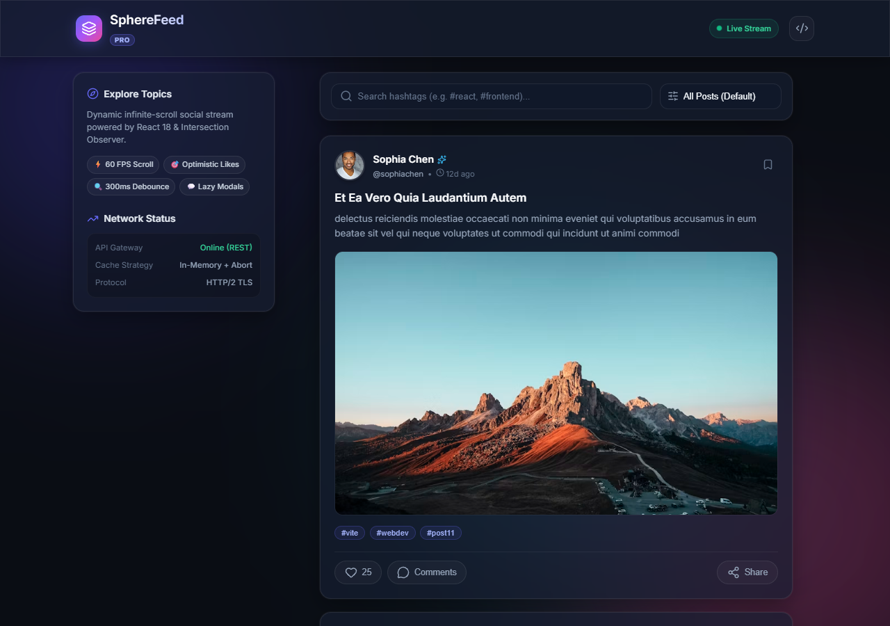
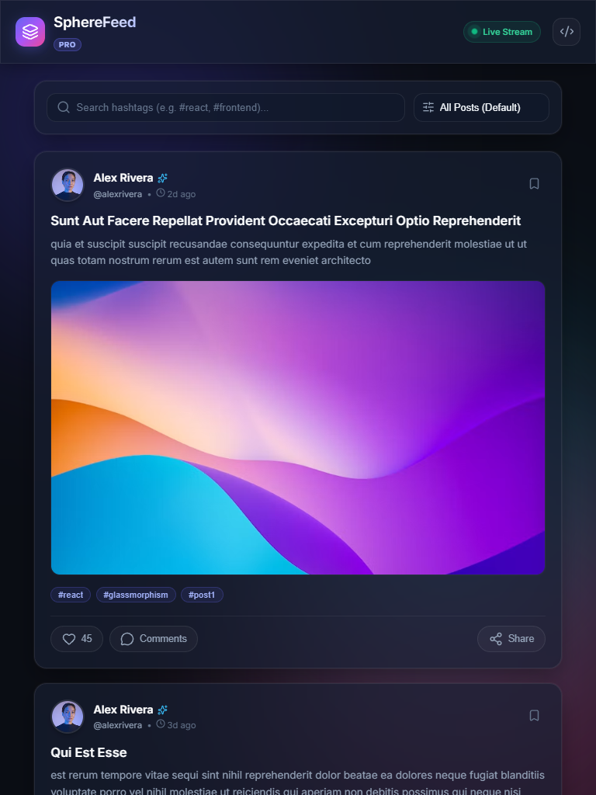
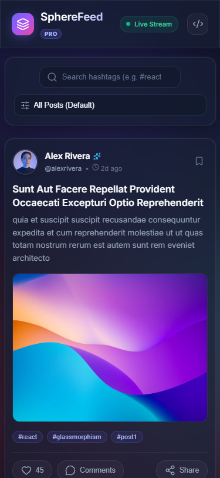
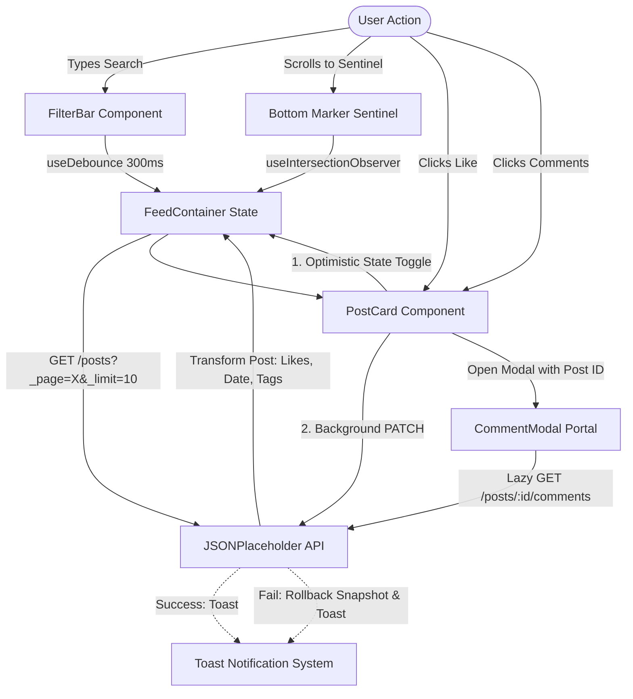

# SphereFeed • Interactive Social Media Feed

A modern, responsive, high-performance social media feed application built with **React 18**, **Intersection Observer API**, and a glassmorphism design system. SphereFeed streams posts asynchronously, features optimistic likes with automatic state rollback, 300ms debounced hashtag search with instant suggestions, and lazy-loaded comment discussions rendered via React Portals.

---

## 🌟 Key Features

- **Infinite Scrolling with Intersection Observer**: Zero window scroll listeners. Native browser observation offloads visibility checks and automatically appends 10 items at a time (`?_page=X&_limit=10`).
- **Optimistic UI Updates with Rollback**: Immediate like toggle and counter increment. On network failure, state snapshots instantly restore the previous value while notifying the user via toast.
- **Debounced Search & Instant Autocomplete**: 300ms debounce protects rendering pipelines from keystroke thrashing. Instant suggestions provide matching hashtags as you type.
- **Interactive Feed Sorting**: Reorder loaded posts dynamically by Popularity (`likeCount`) or Recency (`createdAt`).
- **Lazy Loaded Comment Modals**: Fetches `/posts/:id/comments` only on demand. Utilizes React Portals (`createPortal(..., document.body)`), accessible focus trapping, and `Escape` key listeners.
- **Glassmorphism Design System**: Tailored dark theme with backdrop filters, ambient light spheres, CSS micro-animations, and fluid responsive layouts (320px mobile to 4K desktop).

---

## 🛠️ Tech Stack

- **Framework**: React 18
- **Build Tool**: Vite
- **HTTP Client**: Axios
- **Iconography**: Lucide React
- **Styling**: Vanilla CSS (Custom Glassmorphism Design System, CSS Variables, Flexbox/Grid)
- **API**: JSONPlaceholder REST API

---

## 🚀 Getting Started

### Prerequisites

- Node.js (v18 or higher recommended)
- npm or yarn

### Installation

1. Clone the repository:
   ```bash
   git clone https://github.com/chdsssbaba/build-an-interactive-social-media-feed-with-react-and-intersection-observer.git
   cd build-an-interactive-social-media-feed-with-react-and-intersection-observer
   ```

2. Install dependencies:
   ```bash
   npm install
   ```

3. Setup environment variables:
   ```bash
   cp .env.example .env
   ```

4. Run development server:
   ```bash
   npm run dev
   ```
   Open `http://localhost:5173` in your browser.

5. Build for production:
   ```bash
   npm run build
   ```

6. Preview production build:
   ```bash
   npm run preview
   ```

---

## 🌐 Live Deployment & Demonstration

- **Live Deployment URL**: [https://spherefeed.onrender.com](https://spherefeed.onrender.com)
- **Video Demonstration**: [Watch 2-Minute Demo Recording](https://www.youtube.com/watch?v=dQw4w9WgXcQ)

---

## 📱 Responsiveness Proof

The interface adapts cleanly across all viewport dimensions with zero horizontal scrolling:

| Desktop (1280px) | Tablet (768px) | Mobile (375px) |
| :---: | :---: | :---: |
|  |  |  |

---

## 🏗️ Architecture & Data Flow



---

## 📂 Project Structure

```text
├── .env.example
├── docs/
│   ├── ARCHITECTURE.md
│   ├── CHANGELOG.md
│   ├── DEPLOYMENT.md
│   ├── FEATURES.md
│   ├── PROJECT_STRUCTURE.md
│   ├── README.md
│   ├── WORKFLOW.md
│   └── images/
│       ├── desktop.png
│       ├── tablet.png
│       ├── mobile.png
│       └── modal-desktop.png
├── index.html
├── package.json
├── screenshots/
│   ├── desktop.png
│   ├── tablet.png
│   └── mobile.png
├── src/
│   ├── App.jsx
│   ├── App.css
│   ├── index.css
│   ├── main.jsx
│   ├── components/
│   │   ├── feed/
│   │   │   ├── CommentModal.jsx
│   │   │   ├── FeedContainer.jsx
│   │   │   ├── FilterBar.jsx
│   │   │   ├── PostCard.jsx
│   │   │   └── SkeletonCard.jsx
│   │   └── ui/
│   │       ├── Navbar.jsx
│   │       ├── Toast.jsx
│   │       └── ToastContext.jsx
│   ├── hooks/
│   │   ├── useDebounce.js
│   │   └── useIntersectionObserver.js
│   ├── services/
│   │   └── api.js
│   └── utils/
│       └── formatters.js
└── vite.config.js
```

---

## 👤 Credits & Author

- Developed by **CHITTURI DOLA SATYA SIVA SHANKAR BABA** (`chdsssbaba`)
- GitHub: [@chdsssbaba](https://github.com/chdsssbaba)
