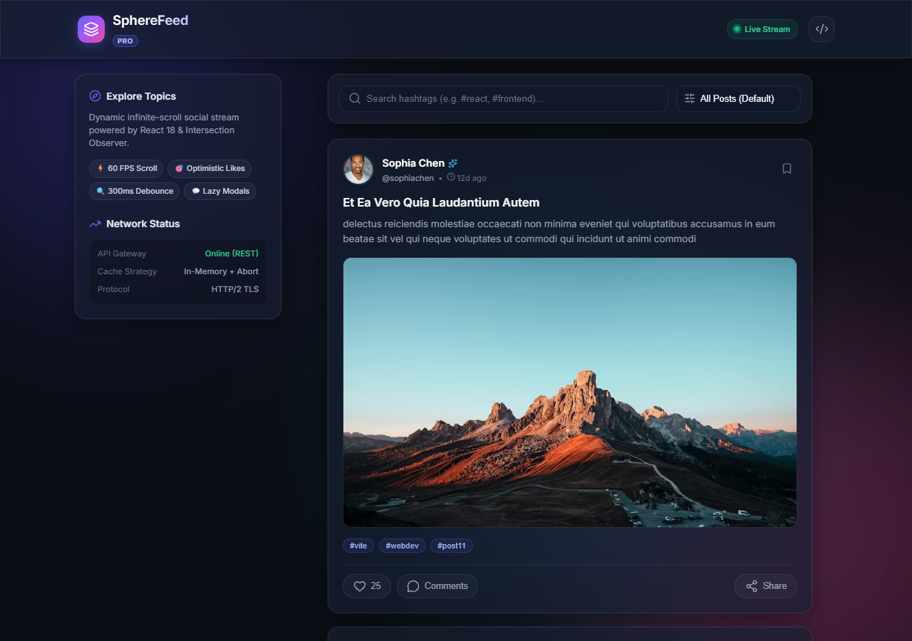
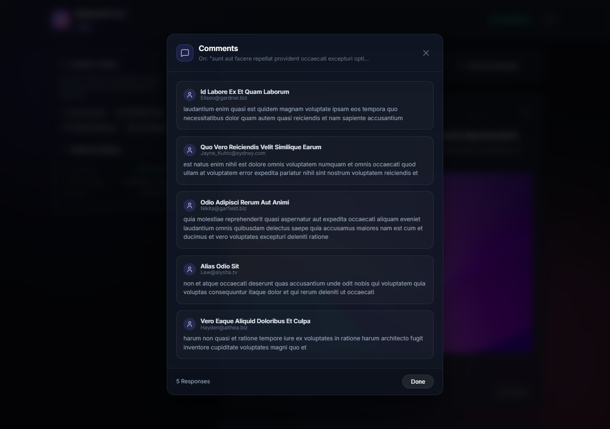

# SphereFeed Documentation Index

Welcome to the internal engineering documentation for **SphereFeed**, an interactive social media feed built using React 18, the browser Intersection Observer API, and modern UX patterns.

## 📚 Table of Contents

- [ARCHITECTURE.md](./ARCHITECTURE.md) - System architecture, state management patterns, and data flow pipelines.
- [PROJECT_STRUCTURE.md](./PROJECT_STRUCTURE.md) - Deep breakdown of directories, files, and role boundaries.
- [WORKFLOW.md](./WORKFLOW.md) - Infinite scrolling, debounce lifecycle, and optimistic UI rollback sequence.
- [DEPLOYMENT.md](./DEPLOYMENT.md) - Production deployment guidelines for Render (Static Site) and configuration.
- [FEATURES.md](./FEATURES.md) - Complete checklist and implementation notes for all 10 core requirements.
- [CHANGELOG.md](./CHANGELOG.md) - Complete record of development milestones and git commits.

## 🖼️ Application Previews

| Standard Feed (Desktop) | Interactive Discussion Thread (Portal Modal) |
| :---: | :---: |
|  |  |
