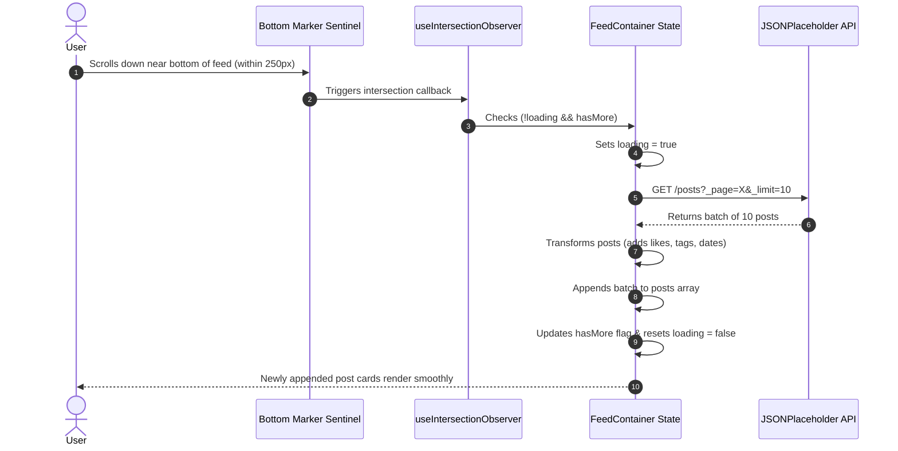
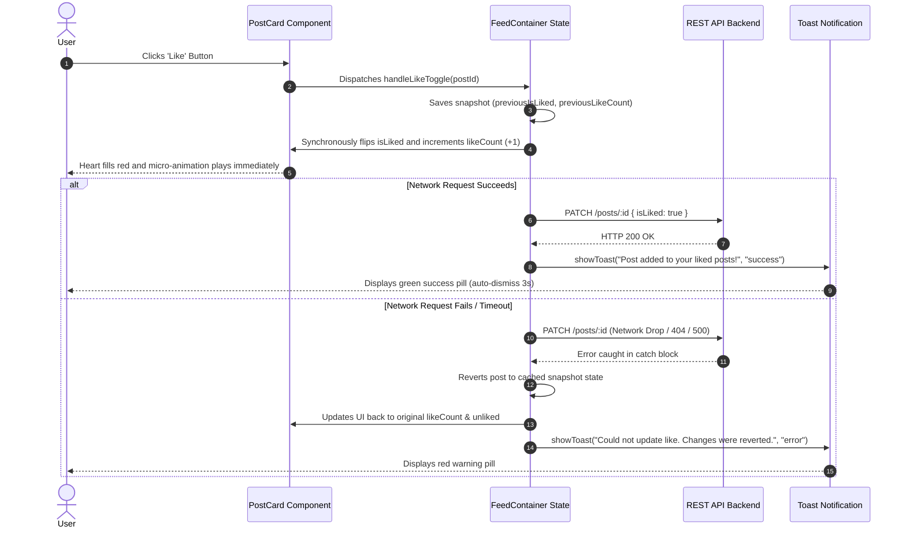
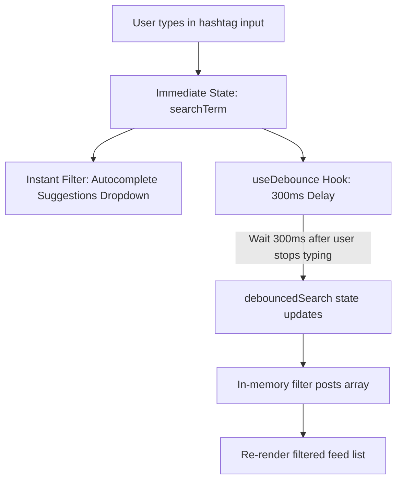

# Workflow & Data Processing Pipelines

This document details the exact execution sequences of the core interactive workflows in SphereFeed.

---

## 1. Infinite Scroll Workflow

---

## 2. Optimistic UI Like & Rollback Sequence

---

## 3. Search Debounce & Instant Autocomplete

